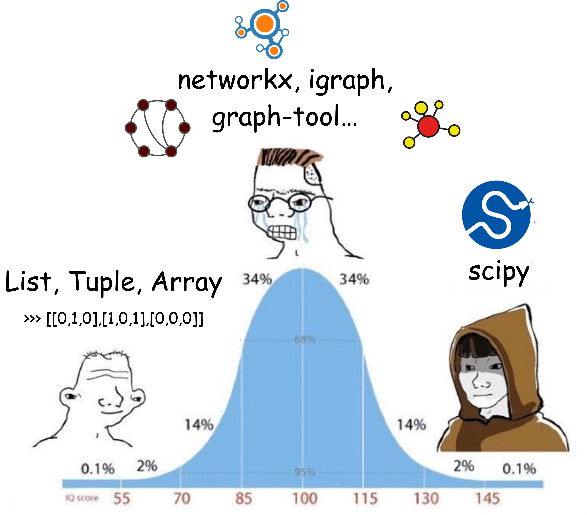

# Toolbox for network analysis

Here are some useful tools for network analysis in Python:

- [Python built-in data structures](https://docs.python.org/3/tutorial/datastructures.html) (list, tuple, dict)
- [networkx](https://networkx.org/) - a beginner-friendly library for network analysis
- [igraph](https://igraph.org/python/) - a mature library with a wide range of algorithms
- [graph-tool](https://graph-tool.skewed.de/) - for stochastic block models
- [scipy](https://scipy.org/) - for analyzing large networks
- [pytorch-geometric](https://pytorch-geometric.readthedocs.io/en/latest/) - for graph neural networks

While `networkx` is a popular and beginner-friendly library for network analysis in Python, we'll be using `igraph` in this course. `igraph` is a mature library with a wide range of algorithms, originally developed for R.
Why `igraph` instead of `networkx`?
Because networkx has some persistent bugs in the implementations of some algorithms (e.g., LFR benchmark and weighted degree assortativity), which can skew the analysis.
`igraph` offers more reliable implementations.

We'll also use `scipy` for scientific computing. `scipy` is one of the most popular Python libraries and also a powerful network analysis tool, especially for large networks. While it requires a bit more effort to learn, once you get the hang of it, you'll find it's a powerful tool for your network analysis projects.

