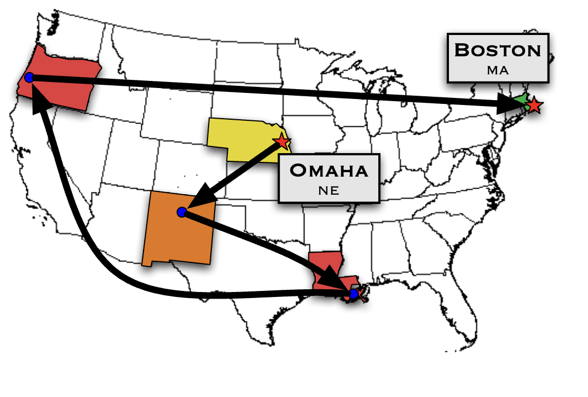
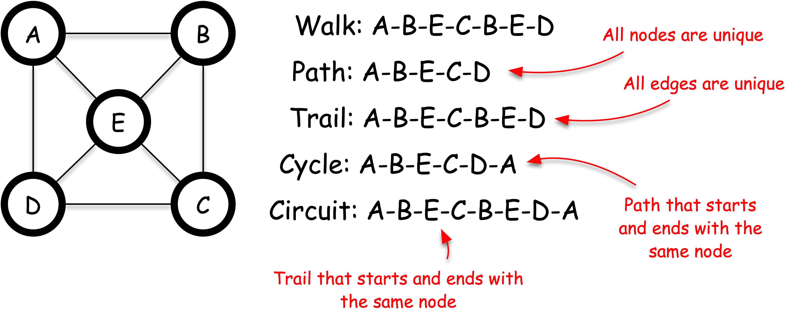
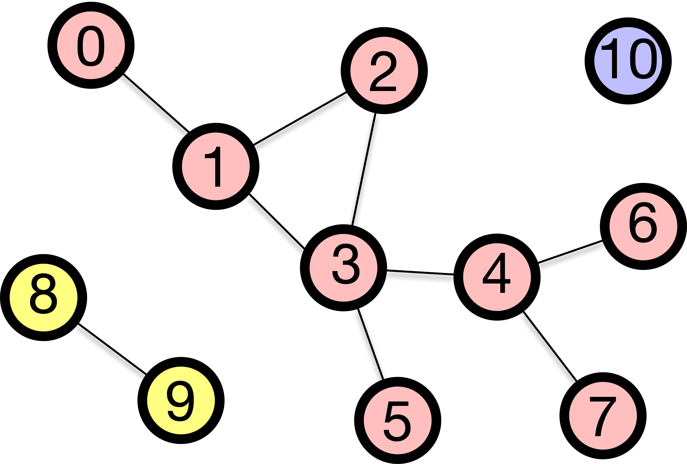
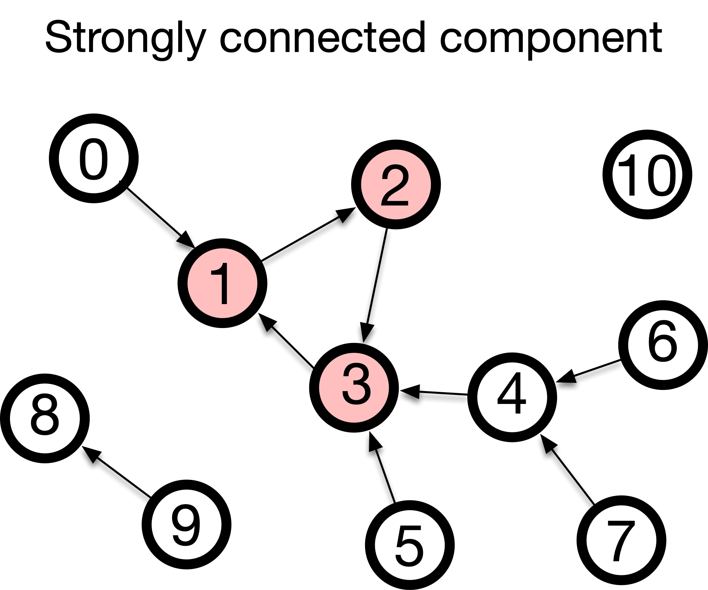

Check list
- [ ] Microphone turned on
- [ ] Zoom room open
- [ ] Sound Volume on
- [ ] Open Discord

---

# Advanced Topics in Network Science

Lecture 02: Break it or Fix it: Network Robustness
Sadamori Kojaku

---

---

---

---

---

# Small World Networks 🌎🔗

What we'll learn:
- 🧪 Small-world experiments
- 📏 Network distance concepts
- 💾 Efficient network data handling
- 🔬 Measuring node distances

---

# Milgram's Small World Experiment 📬

- 📤 Packets sent to random people in Nebraska & Kansas
- 🎯 Goal: Reach target person in Boston
- 📊 Results: ~6 people to reach target (64/160 successful)
- 🌐 "Six degrees of separation" coined later

---

# Modern Small World Confirmations 📱

- 📧 Yahoo email experiment: ~4-7 steps (2009)
- 👥 Facebook study: 4.74 avg. path length (2012)

---

# Wikirace Game 🏁

- 🕹️ Navigate Wikipedia from start to end page
- 🔗 Find shortest path through hyperlinks
- 👀 Experience "small world" phenomenon firsthand

https://wiki-race.com/

---

# Why is the world small?

- 📐 Explore "6 degrees of separation" concept
- 🤔 Understand small world network properties
- 🖊️ Practice network analysis without computer

https://skojaku.github.io/adv-net-sci/m02-small-world/pen-and-paper.html

---

# Handling Large-Scale Networks: Challenges and Solutions

---

# Efficient Network Representation 💾

- 🧮 Challenge: Storing large adjacency matrices
- 💡 Solution: Compressed Sparse Row (CSR) format
- 📊 Stores only non-zero entries
- 🚀 Memory efficient for sparse networks

https://skojaku.github.io/adv-net-sci/m02-small-world/compressed-sparse-row.html

---

# Walk, Trail, Path, Circuit, Cycle

---

# Walk, Trail, Path, Circuit, Cycle

- 🚶 **Walk**: Sequence of connected nodes
- 🛤️ **Trail**: Walk with no repeated edges
- 🛣️ **Path**: Walk with no repeated nodes
- 🔄 Loop, Circuit, Cycle: Special closed walks

---

# Connectedness in Networks

- 🔗 Connected vs Disconnected networks
- 🧩 Connected components
- 🌟 Giant component

---

# Directed Network Connectedness 🔀

- 💪 Strongly connected: Path between all node pairs
- 🤝 Weakly connected: Path ignoring edge direction

---

# Hands-on: Network Analysis with igraph 🛠️

- 📊 Create and visualize graphs
- 🔍 Find shortest paths
- 🧩 Identify connected components
- 🔀 Analyze directed networks

https://skojaku.github.io/adv-net-sci/m02-small-world/connectedness-hands-on.html

---

# Assignment: Small World Experiment 📝

- 🔬 Compute average path length in scientist network
- 💻 Use efficient CSR format
- 🧮 Apply igraph for network analysis

https://skojaku.github.io/adv-net-sci/m02-small-world/assignment.html

---

# Thank You! Questions? 🤔